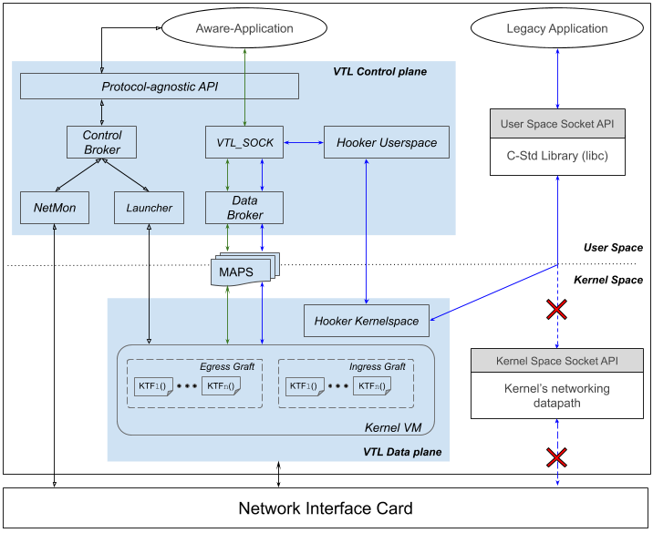

# Virtual Transport Layer (VTL)
Virtual Transport Layer, a protocol deployment management system aiming
(1) to dynamically deploy protocol mechanisms/components, in order
(2) to ensure optimal data moving between end-points.

I am spending time bettering the implementation. Until now the focus has been
on the correctness rather than performance. I will keep correctness, but I will
improve performance, especially in light of practical experience with
applications. Suggestions are welcome.

## Test and run  Hooker:

\> Hooker contains two programs:
* The daemon in /hooker folder, that is created with a make call. It is _user prog_ part of Hooker.
* The _kernel prog_ part that contains mainly two eBPF progs: _**sock_ops**_, to monitor specific or a set of TCP applications, and _**sk_msg**_, to redirect the monitored applications' data.

\> First: build and launch (deploy) kernel prog part:
$ cd bin
$ sudo ./vtl_ui
Follow the instructions and make choices.

\> Second: start user daemon
$ sudo ./hk-daemon <IPPROTO> <HOST_MODE>

	*IPPROTO:* this argument is an integer and is used to indicate which protocol should be used to replace TCP. Indeed, VTL allows the user to manually fix the substitution protocol by specifying one of the supported IP protocol (list below) or let this task to VTL by specified 253 (default) as the argument value.

	List of substitution protocol supported by VTL and their corresponding IP number:
	| Protocol |    IP number [[IANA](https://bit.ly/3nehetj)]   |
	| -------- | --------------------------|
	|   UDP    |             17            |
	| UDPLite  |             136           |
	|   DCCP   |             33            |
	|   SCTP   |             132           |
	|   QUIC   | 142 (conventional in VTL) |
	|   VTL    | 253 (conventional in VTL) |

	*HOST_MODE:* a string to indicate if the hooker daemon will hook either a TCP client or a TCP server. 

\> Finally, just run your TCP applications.