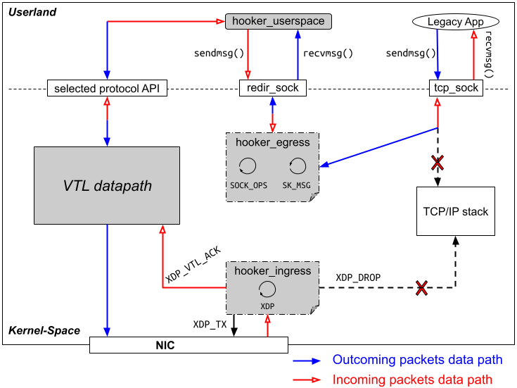

# VTL Introduction

Virtual Transport Layer (VTL) is a protocol deployment management system aiming (1) to dynamically deploy protocol mechanisms/components, in order (2) to ensure optimal data moving between end-points.

## <a name="vtl" /> VTL's Motivation and Architecture

Internet and its evolutions are fundamentally based on the unique TCP/IP model, whose primary protocol of the Transport layer (L4) is the TCP (and somewhat UDP). Despite its well-known limitations, TCP is still widely deployed and used on the Internet. Nearly all the literature's propositions to overcome TCP's limitations are _not deployed_ in the mainstream operating systems (OS) and/or face _limited use_ by the Internet's applications. This situation leads to the _ossification_ or _sclerosis_ of the Transport layer that is a significant barrier to the introduction of innovations in this layer of the Internet's TCP/IP architecture.

To address this issue, we design and implement a **V**irtual **T**ransport **L**ayer (VTL) system able to _dynamically deploy_ Transport protocols within the end-systems' OS. Further, to facilitate the use and stimulate the adoption of the proposed architecture (and the L4 protocols it deploys), we introduce the Hooker component. Hooker provides and mechanisms necessary to allow TCP- based applications to use _transparently_ any Transport protocol other than TCP.

VTL follows three main design principles: (1) the seamless support of legacy applications, i.e., legacy applications might consume Transport services without the need to rewrite their code; (2) the separation of protocol from aware- application, i.e., in line with the service-oriented approach [2], aware-application should request Transport services instead of invoking a specific protocol as it is the case in the standard socket API; and (3) the protocol modularization, i.e., the Transport layer data plane is organized in such a way to allow the implementation of reconfigurable protocols whose components might be dynamically instantiated and parameterized.

## <a name="hk" /> Hooker 

Hooker component’s goal is to provide support to legacy applications. The internal structure of Hooker is shown in Fig. 6. Hooker attaches to the root cgroupv2 [19]; therefore, by making use of the hierarchical model of cgroups, it processes every ingress and egress packets of all processes running on the end-system. Hooker maintains a map of type SOCKMAP that key is a structure containing the addressing information. This key is used by the msg redirector program to identify the right socket towards which the packet data must be forwarded to. Each time a connection is established or closed by one process, the map is updated by msg redirector thanks to a SOCKS_OPS bpf program section attached to cgroupv2.

Every time an application process sends a data packet by calling into sendmsg() on a TCP socket, the SK_MSG bpf program running by msg redirector intercepts it, rewrites it if necessary thanks to the helper function bpf_msg_push_data(). Finally, to deliver the message either to the redirection socket or to the TCP socket, msg redirector program leverages bpf_msg_redirect_map() helper function. The redirection socket is created and maintained by Hooker userspace program which will use the recvmsg() operation to get the redirected data packet and send it to the VTL datapath through the protocol-agnostic API. At the reception, once the host network interface (NIC) receives data packet, the XDP program running by Hooker ingress intercepts the data packet and processes it by issuing the right verdict. The Hooker ingress program can drop the packet data (XDP_DROP), redirect it to the same NIC (XDP_TX) or, as currently done, pass it to the ingress VTL datapath (XDP_VTL_ACK) for further processing.

# <a name="publi" /> Publications

* El-Fadel Bonfoh, D. C. Tape, C. Chassot, S. Medjiah, “Transparent and Dynamic Deployment of Lightweight Transport Protocols”, The 2019 IEEE Global Communications Conference (GLOBECOM), December 2019, Waikoloa, Hawaii, USA.

# <a name="artifact" /> Artifact

The source code of this project is available on [GitHub](https://github.com/elfadel/vtl).