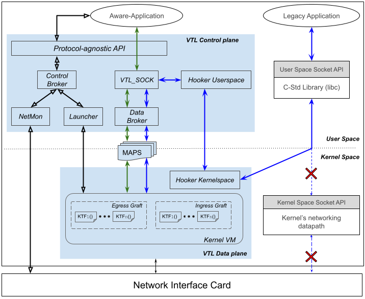

# What it is VTL?

Internet and its evolutions are fundamentally based on the unique TCP/IP model, whose primary protocol of the Transport layer (L4) is the TCP (and somewhat UDP). Despite its well-known limitations, TCP is still widely deployed and used on the Internet. Nearly all the literature's propositions to overcome TCP's limitations are _not deployed_ in the mainstream operating systems (OS) and/or face _limited use_ by the Internet's applications. This situation leads to the _ossification_ or _sclerosis_ of the Transport layer that is a significant barrier to the introduction of innovations in this layer of the Internet's TCP/IP architecture.

To address this issue, we design and implement a **V**irtual **T**ransport **L**ayer (VTL) system able to _dynamically deploy_ Transport protocols within the end-systems' OS. Further, to facilitate the use and stimulate the adoption of the proposed architecture (and the L4 protocols it deploys), we introduce the Hooker component. Hooker provides and mechanisms necessary to allow TCP- based applications to use _transparently_ any Transport protocol other than TCP.

VTL follows three main design principles: (1) the seamless support of legacy applications, i.e., legacy applications might consume Transport services without the need to rewrite their code; (2) the separation of protocol from aware- application, i.e., in line with the service-oriented approach [2], aware-application should request Transport services instead of invoking a specific protocol as it is the case in the standard socket API; and (3) the protocol modularization, i.e., the Transport layer data plane is organized in such a way to allow the implementation of reconfigurable protocols whose components might be dynamically instantiated and parameterized.

